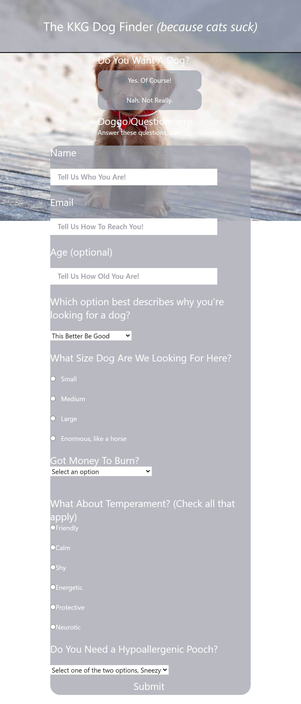

# KKG Dogs

## Group 4: 
"As a recently graduated bootcamp student, I now have a job where I can work remote and would like to get a dog as a companion. I want an application to help me narrow my search to find the right dog for me."

## Expected Behavior:
* WHEN I get to the website
THEN I'm asked a simple yes or no question about if I want a dog
* WHEN I answer NO to said first question
THEN I am presented with a gif of the titanic hitting an iceberg
* WHEN I answer YES to the first question  - Do I want a dog?
THEN the other options go away
* WHEN I scroll down
THEN I see 3 user input fields
* WHEN I scroll down more
THEN I'm presented with 4-5 clarifying questions
* WHEN I answer the next 4-5 questions concerning reasons, size, temperament, cost, and hypoallergenic status
THEN I am presented with the options for the ideal dog breed for me

## Link to Live Site and GitHub Repository
1. [KKG Dog Finder](https://kstayslc.github.io/KKG-Dogs/)
2. [GitHub Repository](https://github.com/KStaySLC/KKG-Dogs)

## Assets
The following image demonstrates, sort of, the web application's appearance and functionality:

